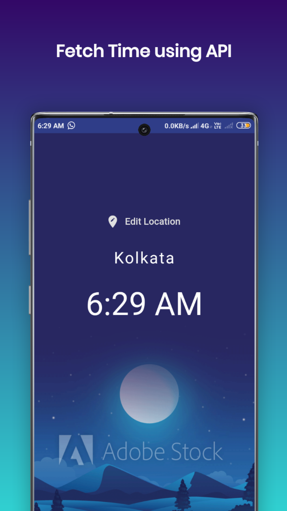

  

(Android/iOS)

<h1 align="center">WorldTime</h1>  

 
   

  

## Screenshots

## Deployment
Apk Link:   

   

<h3>Building</h3>

Android Release: `flutter build apk` 

Android (arm64-v8a)/(armeabi-v7a): `flutter build apk --split-per-abi`  

If you have a connected device or emulator you can run and deploy the app with `flutter run` 
